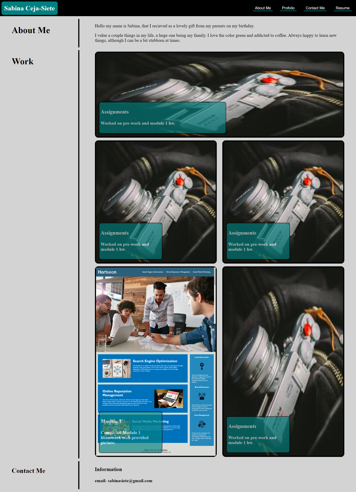

# Portfolio

## Description
Wrote a css text to keep my webpage colorful and pretty by editing it any color or font size. For example having the buttons have the correct criteria. 

Coded the html file to keep it oragnize and have added text about myself and properly linked images to view. 

## Resources
https://www.w3schools.com/html/html_images.asp

## Contact Me

sabinasiete@gmail.com

## Screenshot 

https://unisabi.github.io/Portfolio/#work

